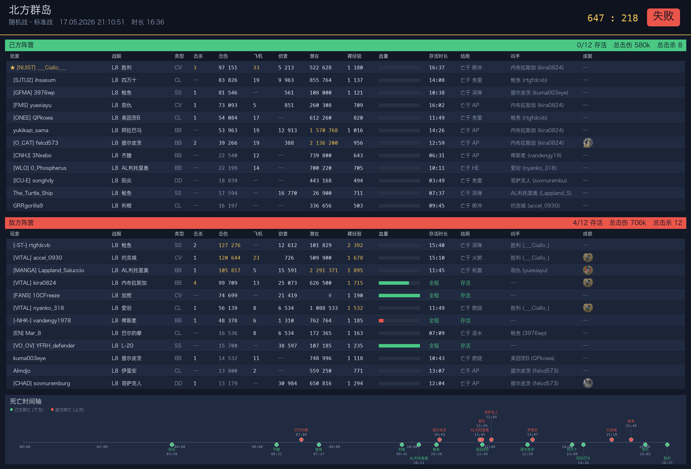
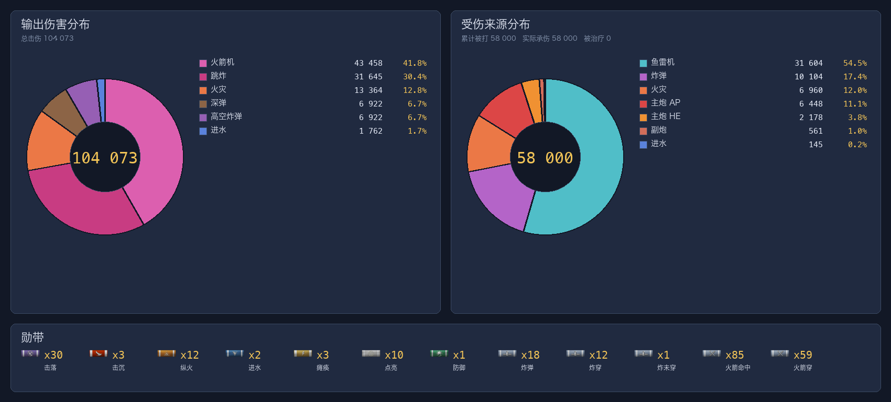

# wows_report_bot

从战舰世界（WoWs）的 `.wowsreplay` 回放文件生成中文战报 PNG，便于 QQ 机器人调用。

提供三种输出：

| 命令 | 输出 | 用途 |
|---|---|---|
| `bin/wows_report` | **全队战报 PNG** (`<replay>.png`) | 双队完整表格 + 死亡时间轴 + 主角个人战绩 |
| `bin/wows_damage_report` | **伤害复盘 PNG** (`<replay>.damage.png`) | 主角输出/受伤来源双饼图 + 勋带（带图标） |
| `bin/wows_full_report` | **战报 + 复盘合并 PNG** (`<replay>.full.png`) | 竖向拼接前两张图（自动去重 header / 个人战绩），适合一图直发 |

三个命令共用同一套依赖（replayshark / specs / data），部署一次即可全部使用。

## 示例输出

> 实际由 `bin/wows_full_report` 在一台 Asia 服 15.3 回放上生成。

| 全队战报 | 伤害复盘 | 合并图（推荐） |
|---|---|---|
|  |  |  |

## 数据流

```
.wowsreplay (15.x+，Asia 服 / CN 服都支持)
   → replayshark (Rust)             输出 JSON（每人战绩、死亡、聊天、results_info）
   ├→ render_battle_report.py (PIL)  全队战报 PNG
   └→ render_damage_chart.py  (PIL)  主角伤害复盘 PNG（饼图 + 勋带）
```

全队战报 PNG 包含：双队完整战绩表（击杀 / 击伤 / 飞机 / 侦查 / 潜在 / 裸经验 / 血量 / 死因 / 凶手 / 成就图标），死亡时间轴，主角个人战绩区。

伤害复盘 PNG 包含：输出伤害按武器类型分布的环形图（主炮 AP/HE/CS、副炮、鱼雷、各舰载机、火灾/进水/撞击等），受伤来源同款环形图（并标注累计被打 / 实际承伤 / 被治疗），底部勋带行（主炮命中/穿透/过穿/跳弹/命中装甲区/击落/纵火/进水…，带图标 + 计数）。

## 目录结构

```
wows_report_bot/
├── bin/
│   ├── wows_report                # 全队战报入口（Python）
│   ├── render_battle_report.py    # 全队战报 PNG 渲染器
│   ├── wows_damage_report         # 伤害复盘入口（Python）
│   ├── render_damage_chart.py     # 双饼图 + 勋带渲染器
│   └── wows_full_report           # 战报+复盘合并入口（内部串联前两者，自动竖向拼接）
├── data/                          # 长期资源（很少变）
│   ├── achievement_icons/         # ~400 张成就图标
│   ├── ribbon_icons/              # ~55 张勋带图标
│   ├── achievements.json          # ID → index 映射
│   ├── constants.json             # 结算字段下标表（来自 padtrack/wows-constants）
│   └── zh_sg.mo                   # 中文翻译 gettext 词条
├── specs/                         # 每个大版本一次（家里跑 update_specs.py 后 scp 上来）
│   ├── metadata.toml              # 版本号 + build 号
│   ├── scripts/                   # entity 定义 XML
│   └── content/GameParams.data    # 船 / 成就参数字典
├── tools/
│   ├── update_specs.py            # 从 wowsinfo/data 拉最新 specs
│   └── replayshark_battle_report.patch
├── prebuilt/
│   └── replayshark-linux-x86_64   # 预编译 Linux x86_64 二进制，开箱即用
└── replayshark                    # 实际使用的二进制（从 prebuilt/ 复制或自己 build，见 DEPLOY.md）

Python 依赖（Pillow + polib）走系统包即可，脚本默认调系统 `python3`，不强制虚拟环境。
```

## 快速调用

`DEPLOY.md` 一次性配好 Linux 后，三个命令都能用：

```bash
# 全队战报 PNG
/path/to/wows_report_bot/bin/wows_report /path/to/replay.wowsreplay [输出目录]
# stdout 最后一行 = <输出目录>/<回放名>.png

# 主角伤害复盘 PNG（输出/受伤双饼 + 勋带）
/path/to/wows_report_bot/bin/wows_damage_report /path/to/replay.wowsreplay [输出目录]
# stdout 最后一行 = <输出目录>/<回放名>.damage.png

# 战报 + 复盘合并 PNG（一张图发出去）
/path/to/wows_report_bot/bin/wows_full_report /path/to/replay.wowsreplay [输出目录]
# stdout 最后一行 = <输出目录>/<回放名>.full.png
```

> 三个命令**完全共享部署**（Rust 二进制、specs、data 资源），不需要单独配置或重新跑 DEPLOY.md。
> `wows_full_report` 内部依次调 `wows_report` + `wows_damage_report`，并通过环境变量
> `WOWS_SKIP_PERSONAL=1` / `WOWS_SKIP_HEADER=1` 让渲染器跳过会重复出现的版块，
> 然后用 PIL 把两张图等比拼成一张。

## 工作流程

| 频率 | 在哪 | 干什么 |
|---|---|---|
| 一次 | Linux bot 主机 | 跟 **DEPLOY.md** 部署（装 Rust、build replayshark、装 Pillow/polib） |
| WoWs 每次大版本更新 | 家里 Win/Mac | 跑 `tools/update_specs.py`，然后 `scp specs_out/ → bot:specs/` |
| 每次玩家请求战报 | Linux bot | subprocess 调 `bin/wows_report` / `wows_damage_report` / `wows_full_report` |

更多见 `DEPLOY.md` 和 `UPDATE.md`。
