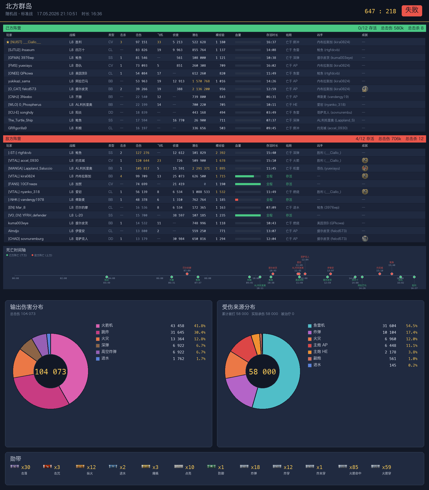

# wows-bot

战舰世界 (WoWs) 的 QQ 机器人:接收玩家发来的 `.wowsreplay` 回放文件,
并行渲染 **小地图 MP4** + **战报 / 复盘合并 PNG**,一起发回 QQ。



## 核心能力

| 产物 | 来自 | 触发 |
|---|---|---|
| 小地图 MP4 | [wows-toolkit](https://github.com/landaire/wows-toolkit) 的 `minimap_renderer` (Rust) | 自动 |
| 战报 + 复盘合并 PNG | 本仓库 `report/` 下 PIL 渲染器 + 自带的 `replayshark` | 自动 |
| LLM 中文战后复盘 (DeepSeek) | 本仓库 `report/bin/wows_analyze` | 开关型,`/分析 开` 后每份 replay 都附带 |
| QQ 接收 / 发送 / 排队 | 本仓库 `plugin/minimap.py` (NoneBot 2 + OneBot v11) | 用户发 `.wowsreplay` 触发 |

两个渲染并行跑,等都完成后用一条消息合并发出 (MP4 作为文件上传,PNG 作为图片附在文字下)。
PNG 失败只降级提示,不影响 MP4 主流程。

如果该聊天上下文 (群/私聊) 之前发过 `/分析 开`,会在 MP4+PNG 之后再追发一条 DeepSeek 出的中文战后复盘文本 (基于 replayshark 出的结构化战报 JSON,不是看图,精度高)。`/分析 关` 关闭、`/分析 状态` 查询当前状态。

## 仓库结构

```
wows-bot/
├── README.md                       这份文档
├── docs/
│   ├── DEPLOY.md                   一站式 Linux 部署
│   ├── UPDATE.md                   WoWs 游戏版本更新后刷新数据
│   └── images/                     示例样图
├── plugin/
│   └── minimap.py                  NoneBot 插件 (复制到你 bot 的 plugins/ 下)
├── report/                         战报 PNG 渲染器
│   ├── bin/                        wows_report / wows_damage_report / wows_full_report + 渲染脚本
│   ├── data/                       图标 / 翻译 .mo / 常量 json
│   └── prebuilt/                   replayshark Linux x86_64 预编译
├── minimap/
│   └── render.sh                   MP4 渲染 wrapper (调用外部 wows-toolkit)
└── tools/
    ├── build_specs_from_local.py   从已解包的 wows-toolkit extracted 出 specs
    ├── update_specs.py             从社区镜像 wowsinfo/data 拉 specs
    └── replayshark_battle_report.patch
```

## 数据流

```
QQ 用户发 .wowsreplay
    └─> plugin/minimap.py 入队
            ├─> minimap/render.sh ──> /opt/wows-toolkit/minimap_renderer ──> MP4
            └─> report/bin/wows_full_report ──> replayshark + PIL ──> PNG
                                                                       ↓
                              MP4 作为文件 + PNG 作为图片,合并发回 QQ
```

## 快速开始

完整部署见 [docs/DEPLOY.md](docs/DEPLOY.md)。

游戏每出大版本后,刷新数据见 [docs/UPDATE.md](docs/UPDATE.md)。

## License

MIT — 见 [LICENSE](LICENSE)。
